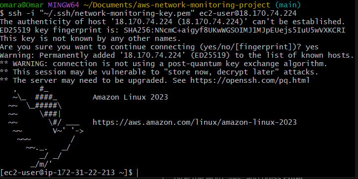
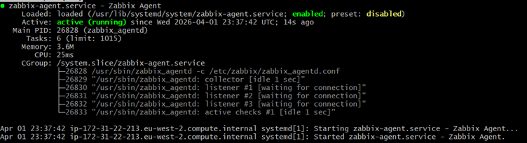

# AWS Network Monitoring Project
A cloud-based network monitoring infrastructure built on AWS, provisioned with Terraform, and automated with Python. Built to demonstrate cloud and NetDevOps skills relevant to NOC and network engineering roles at UK ISPs and telcos.

---
## Architecture
*Full architecture diagram coming in Phase 11*

---
## Phase 1 — EC2 Deployment
**Goal:** Deploy a monitored EC2 instance on AWS as the foundation for the monitoring infrastructure.

**What was built:**
- Amazon Linux 2023 t2.micro instance in eu-west-2 (London)
- Zabbix agent installed and running for SNMP-based monitoring
- Security group configured to allow SSH from authorised IP only

**Technologies used:** AWS EC2, Amazon Linux 2023, Zabbix Agent

**Screenshot — SSH connection:**

**Screenshot — Zabbix agent running:**

---
## Technologies Used
| Technology | Purpose |
|---|---|
| AWS EC2 | Cloud compute instance |
| Amazon Linux 2023 | Server OS |
| Zabbix Agent | Network monitoring agent |

---
*This project is built incrementally across 11 phases. Each phase adds a new layer of infrastructure, automation, or observability.*
